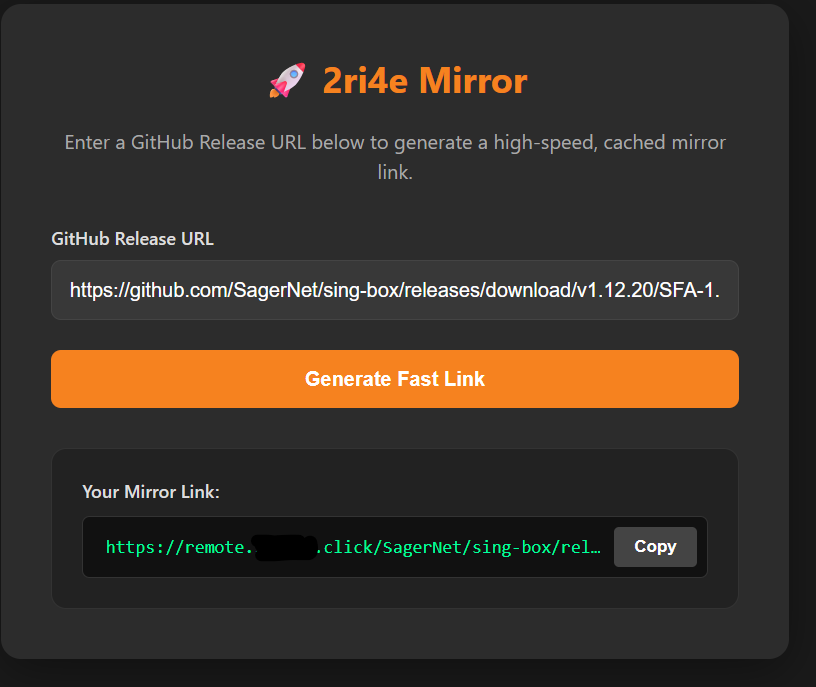
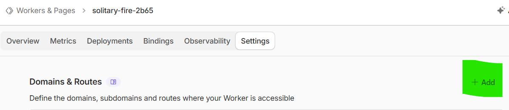
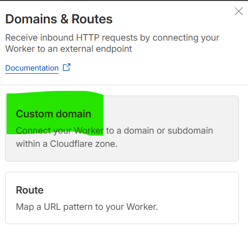
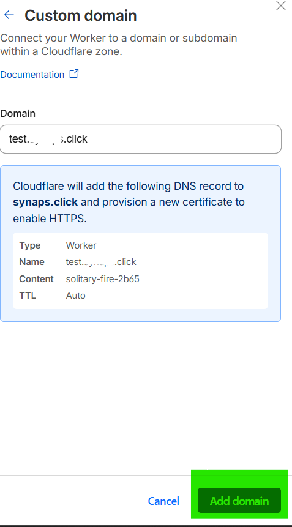

# میرور پرسرعت گیت‌هاب با کلودفلر (Cloudflare Worker GitHub Mirror) 🚀

<!-- Language Switcher Buttons -->

یک ابزار پرسرعت برای دانلود فایل‌های GitHub Release که بر روی Cloudflare Workers اجرا می‌شود. این ابزار دارای یک رابط کاربری ساده است و لینک‌هایی تولید می‌کند که از **دانلود منیجرها (IDM, ADM)** و **قابلیت Resume (توقف و ادامه دانلود)** پشتیبانی می‌کنند.

## ویژگی‌ها
- ⚡ **کَش سرور (Edge Caching):** فایل‌ها را روی سرورهای کلودفلر ذخیره می‌کند تا دانلودهای بعدی با نهایت سرعت انجام شوند (برای فایل‌های زیر ۵۱۲ مگابایت در پلن رایگان).
- ⏩ **استریمینگ (Streaming):** قابلیت دانلود فایل‌های حجیم بدون پر شدن حافظه Worker.
- ⏯️ **پشتیبانی از Resume:** پشتیبانی از هدر `Range` برای توقف و ادامه دانلود.
- 🖥️ **رابط کاربری:** دارای صفحه وب ساده و دکمه کپی لینک.

## تصاویر محیط کار (Screenshots)

| رابط کاربری | تنظیمات کاستوم دامین |
| :---: | :---: |
|  |  |
| **تنظیمات** | **اضافه کردن کاستوم دامین ** |
|  |  |

## نصب و راه‌اندازی

1. وارد **Cloudflare Dashboard** شوید.
2. به بخش **Workers & Pages** بروید و روی **Create Application** و سپس **Create Worker** کلیک کنید.
3. یک نام انتخاب کنید (مثلاً `gh-mirror`) و **Deploy** را بزنید.
4. روی **Edit Code** کلیک کنید.
5. کدهای پیش‌فرض را پاک کرده و کد پروژه `index.js` را جایگزین کنید.
6. دکمه **Save and Deploy** را بزنید.

## 🌟 پیشنهاد ویژه: تنظیم دامنه اختصاصی (Custom Domain)

برای عملکرد بهتر و جلوگیری از محدودیت‌ها یا فیلترینگ احتمالی دامنه `workers.dev`، به شدت توصیه می‌شود که ورکر را روی دامنه شخصی خودتان ست کنید.

### روش تنظیم دامنه اختصاصی:

1. در داشبورد کلودفلر، به صفحه **Workers & Pages** بروید.
2. در بخش **Overview**، ورکری که ساخته‌اید را انتخاب کنید.
3. به تب **Settings** بروید و سپس **Domains & Routes** را انتخاب کنید.
4. روی **+ Add** کلیک کرده و **Custom Domain** را انتخاب کنید.
5. دامنه یا ساب‌دامنه‌ای که می‌خواهید استفاده کنید را وارد کنید (مثلاً `dl.yourdomain.com`).
   * *نکته: این دامنه باید از قبل در اکانت کلودفلر شما فعال باشد.*
6. دکمه **Add Custom Domain** را بزنید.

## نحوه استفاده

1. آدرس ورکر خود را باز کنید (مثلاً `https://dl.yourdomain.com`).
2. لینک دانلود فایل مورد نظر از گیت‌هاب را وارد کنید (مثلاً `https://github.com/user/repo/releases/download/v1.0/app.zip`).
3. روی دکمه **Generate Fast Link** کلیک کنید.
4. لینک جدید را کپی کرده و در دانلود منیجر خود استفاده کنید.

---

## سلب مسئولیت
این پروژه برای استفاده شخصی و میرور کردن نرم‌افزارهای متن‌باز (Open Source) طراحی شده است. لطفاً قوانین استفاده از گیت‌هاب را رعایت کنید.
